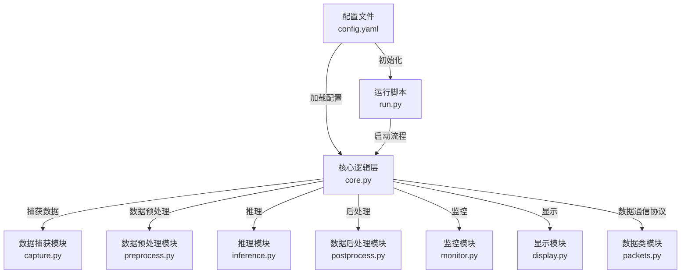

# StreamCat (stream ver.)
## 概览

LoLA_hsViT的边缘部署部分，用RGB摄像头代替hsi数据流输入。
`run.py`作程序入口，数据流式处理

### 用法
```
bash

python app.py --config /home/chenhaoran/StreamCat/config/config.yaml

python run.py -c --env-profile server_test --backend grpc --grpc-target localhost:8001 --npy-dir /data/chenhaoran/processed_npy_64_norm --npy-glob 'bailijie_20250429_LD.npy' --npy-fps 8 --headless

# 其它自定义参数见run.py
```

### MONAI服务层（HTTP/gRPC/Metrics）
```
bash

# 启动MONAI服务层
python server/app.py --config config/config.yaml

# HTTP健康检查
curl http://localhost:8000/health/live
curl http://localhost:8000/health/ready

# Metrics
curl http://localhost:8002/metrics
```

端口约定：
- HTTP: 8000
- gRPC: 8001
- Metrics: 8002
### 工作流



## 工作结构
```
StreamCat/
├── config/                 # 参数配置
│   ├── __init__.py
│   ├── config.yaml         # 项目配置文件
│   └── loader.py
├── pipeline/               # 工作流类
│   ├── __init__.py
│   ├── core.py             # 封装总线
│   ├── capture.py          # 数据捕获模块
│   ├── preprocess.py       # 数据预处理模块
│   ├── interface.py        # 推理模块
│   ├── postprocess.py      # 数据后处理模块
│   ├── monitor.py          # 栈内外监视服务
│   ├── display.py          # 显示模块
│   └── packets.py          # 模块间通信协议(数据传输类)
├── server/                 # MONAI服务层
│   ├── app.py              # 服务入口
│   ├── config.py           # 服务配置加载
│   ├── grpc_service.py     # gRPC推理接口
│   ├── http_api.py         # HTTP监测调试
│   ├── metrics.py          # Prometheus指标
│   ├── model_runtime.py    # MONAI运行时封装
│   └── proto/              # gRPC协议定义
├── docker/
│   └── entrypoint.sh       # 镜像启动脚本
├── scripts/
│   └── gen_proto.sh        # 生成gRPC Python桩代码
├── src/                    # .md插图资源
│   ├── xxx.png
│   └── ...
├── run.py                  # 用户层入口
├── monitor.py              # 资源监视器 (服务调用)
├── LOG.md
├── README.md
├── requirements.txt
└── ...
```

## bugs & to-do
### bugs
- 作调试用的RGB数据流需要`(3, H, W)` -> `(H, W)`型的推理引擎，需额外引入这样的测试模型。
### to-do
- 做延时剖析，确定瓶颈；
- 队列调优、线程绑定、零拷贝优化；
- 异常帧保护、断流重连、置信度告警；
- 容器封装、开机自启、日志与指标上报、模型热更新、回滚。
